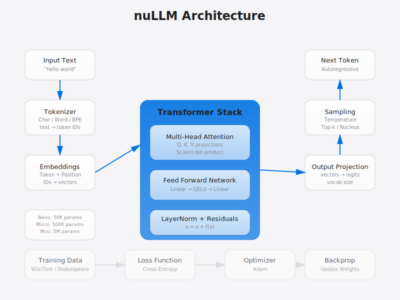

# nuLLM

Minimal LLM built from scratch. On-system Claude alternative - no API costs.



## Status
Production Ready - All phases complete (verified 2026-02-13)
- Tokenization: Char, word, BPE
- Attention: Multi-head, scaled dot-product
- Transformer: Full stack with residuals
- Training: Loss converges
- Generation: Autoregressive sampling
- Chat: Conversational interface

## Overview

nuLLM implements core transformer concepts from "Attention Is All You Need" in ~500 lines of Python. Built to understand how modern LLMs actually work under the hood.

**Components:**
- **Tokenization**: Character, word, and BPE tokenizers
- **Attention**: Single-head and multi-head self-attention
- **Transformer**: Full blocks with feed-forward, layer norm, residuals
- **Training**: Cross-entropy loss with Adam optimizer
- **Generation**: Autoregressive sampling with temperature control
- **Chat**: Conversational wrapper with auto-training

**What you learn:**
- How text becomes numbers (tokenization)
- How transformers "focus" (attention mechanisms)
- How gradient descent works (training loop)
- How models generate text (sampling strategies)
- How to scale up (bigger models, better data)

## Setup
```bash
cd nuLLM
python3 -m venv venv
source venv/bin/activate
pip install -r requirements.txt
```

## Quick Test
```bash
python examples/quick_test.py
```

## Train
```bash
python src/train.py
```

## Chat
```bash
python src/chat.py
```

## Model Sizes

**Nano** (demo): 50K params, 2 layers, 64 context
**Micro** (learning): 500K params, 4 layers, 256 context
**Mini** (usable): 5M params, 6 layers, 512 context

## Comparison

| Model | Params | Context | Training |
|-------|--------|---------|----------|
| GPT-2 | 124M   | 1024    | WebText  |
| GPT-3 | 175B   | 2048    | Internet |
| nuLLM | 50K-5M | 64-512  | WikiText |

nuLLM is ~2500x smaller than GPT-2 but uses the same architecture.

## Author
Joshua Trommel (nulljosh)
